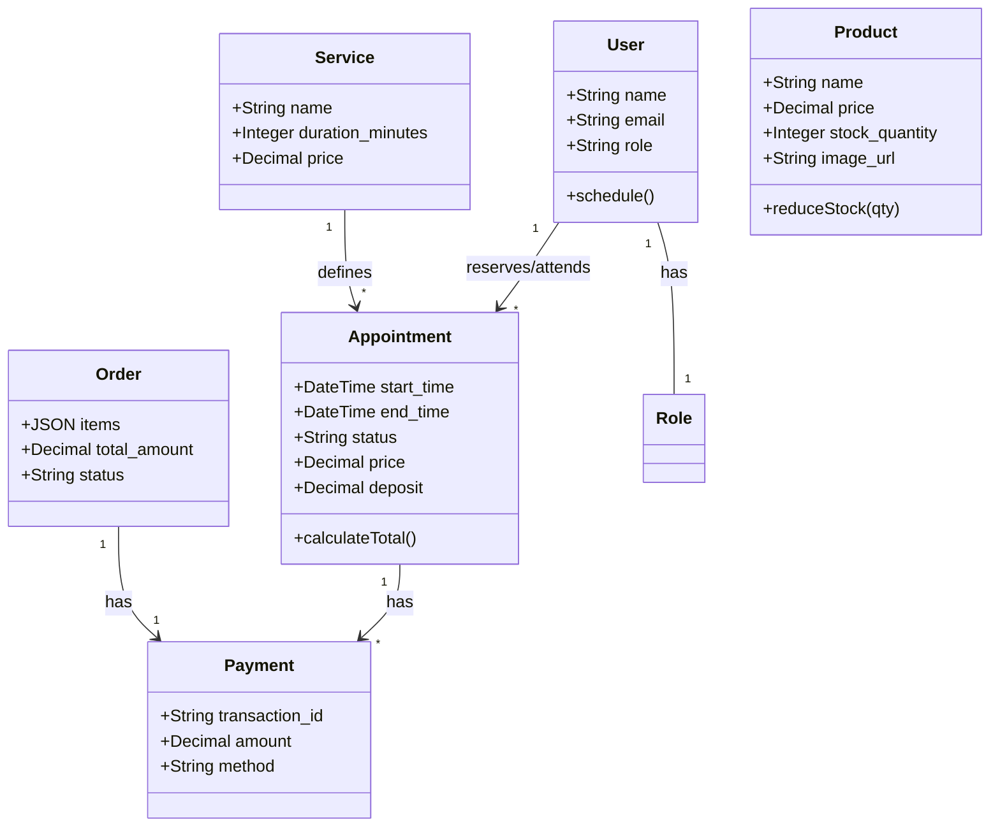
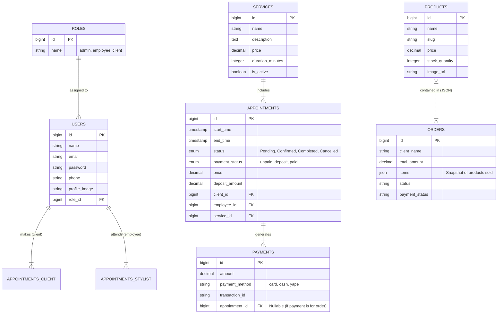

# 📘 Documentación Técnica - Sistema Lumina

Este documento detalla la arquitectura, requisitos y modelado de datos del sistema de gestión para salones de belleza "Lumina".

---

## 1. Modelo de Negocio

Lumina es una plataforma SaaS (Software as a Service) diseñada para digitalizar la operación de salones de belleza de alta gama.

### Propuesta de Valor
*   **Para el Cliente Final:** Una experiencia de reserva "One-Page" premium, fluida y visual, que permite agendar citas y comprar productos sin fricción.
*   **Para el Negocio:** Centralización de la agenda, control de inventario y unificación de la caja (pagos de servicios + ventas de productos) en un solo dashboard.

### Flujos de Ingreso
1.  **Reservas de Servicios:** Cobro de depósitos (20%) online y liquidación final en local.
2.  **Venta de Productos (E-commerce):** Venta directa de productos de belleza desde la landing page.
3.  **Venta Cruzada (Cross-selling):** Oferta de productos adicionales durante el checkout del servicio o en el cierre de caja.

---

## 2. Requerimientos

### 2.1 Requerimientos Funcionales

#### Modulo de Cliente (Público)
*   **RF-01 Visualización de Catálogo:** El usuario debe poder ver servicios y productos con imágenes de alta calidad y precios actualizados.
*   **RF-02 Gestión de Carrito:** El usuario debe poder agregar/quitar productos a un carrito de compras persistente (localStorage) en el panel lateral.
*   **RF-03 Reserva de Citas:** El usuario debe poder seleccionar un servicio, un estilista disponible y un bloque horario válido (validación de hora pasada y duración).
*   **RF-04 Pasarela de Pagos Unificada:** El sistema debe procesar tanto reservas (depósitos) como compras de productos (total) a través de un checkout simulado (Tarjeta/QR).
*   **RF-05 Login/Registro:** El sistema debe crear automáticamente una cuenta de usuario al reservar si no existe, basada en el correo electrónico.

#### Módulo de Estilista
*   **RF-06 Visualización de Agenda:** El estilista debe ver sus citas diarias y semanales con estado actual (Confirmada, Completada).
*   **RF-07 Detalle de Cita:** Acceso a la información del cliente y notas de la reserva.
*   **RF-08 Proceso de Cobro (Móvil):** Capacidad de cerrar una cita y cobrarla desde su dispositivo (opcional, compartido con admin).

#### Módulo de Administrador
*   **RF-09 Gestión de Stock:** Control de inventario de productos. Descuento automático al confirmar una compra online o venta en caja.
*   **RF-10 Cierre de Caja (POS):** Interfaz para finalizar citas, calculando el restante a pagar (Precio Servicio - Depósito) y permitiendo agregar productos adicionales a la transacción.
*   **RF-11 Gestión de Usuarios:** Creación y edición de estilistas y sus horarios.

### 2.2 Requerimientos No Funcionales
*   **RNF-01 Estética:** Interfaz de usuario "Lumina Premium" (Gradientes Teal/Slate, Glassmorphism, animaciones suaves).
*   **RNF-02 Rendimiento:** La landing page debe cargar en menos de 2 segundos (Single Page Application feel).
*   **RNF-03 Seguridad:** Roles y permisos estrictos (Middleware `admin`, `stylist`).
*   **RNF-04 Disponibilidad:** El sistema de reservas debe prevenir la sobreventa de horarios (bloqueo concurrente).

---

## 3. Diagramas de Modelado

### 3.1 Diagrama de Casos de Uso (Mermaid)

```mermaid
usecaseDiagram
    actor "Cliente" as C
    actor "Estilista" as E
    actor "Administrador" as A

    package "Front Office (Público)" {
        usecase "Explorar Servicios" as UC1
        usecase "Agregar Productos al Carrito" as UC2
        usecase "Reservar Cita" as UC3
        usecase "Pagar Online (Pasarela)" as UC4
    }

    package "Back Office (Gestión)" {
        usecase "Ver Agenda Personal" as UC5
        usecase "Gestionar Agenda Global" as UC6
        usecase "Finalizar Cita & Cobrar (POS)" as UC7
        usecase "Gestionar Inventario" as UC8
    }

    C --> UC1
    C --> UC2
    C --> UC3
    UC2 ..> UC4 : include
    UC3 ..> UC4 : include

    E --> UC5
    E --> UC7

    A --> UC6
    A --> UC7
    A --> UC8
```

### 3.2 Diagrama de Clases (Arquitectura MVC Simplificada)



---

## 4. Diseño de Base de Datos (Físico/Lógico)

### Diagrama Entidad-Relación (ERD)



---

## 5. Diccionario de Datos

### Tabla `users`
Almacena todos los actores del sistema. Se diferencian por `role_id`.
*   **id**: Identificador único.
*   **name**: Nombre completo.
*   **email**: Credencial de acceso y notificaciones.
*   **role_id**: FK a tabla `roles` (1: Admin, 2: Estilista, 3: Cliente).

### Tabla `appointments`
El corazón del sistema de reservas.
*   **start_time / end_time**: Definen el bloqueo en el calendario.
*   **status**:
    *   `Pending`: Creada pero no pagada (depósito).
    *   `Confirmed`: Depósito pagado, espacio reservado.
    *   `Completed`: Servicio realizado y pagado totalmente.
    *   `Cancelled`: Cancelada por usuario o admin.
*   **payment_status**: Controla la deuda financiera `unpaid` -> `deposit` (20%) -> `paid` (100%).

### Tabla `products`
Inventario para la tienda y venta cruzada.
*   **stock_quantity**: Cantidad física disponible. Se debe decrementar al crear una `Order` o finalizar una `Appointment` con productos extra.
*   **image_url**: URL de la imagen (soporta rutas locales `/images/` o externas `http`).

### Tabla `orders`
Representa una compra en la tienda online.
*   **items (JSON)**: Almacena una copia de los productos comprados `[{id, name, price, qty}]`. Se usa JSON para mantener el histórico de precios aunque el producto cambie después.
*   **payment_status**: `unpaid` -> `paid` (vía Pasarela).

### Tabla `payments`
Registro de auditoría financiera.
*   **transaction_id**: Código único generado por la pasarela (simulado) para conciliación.
*   **method**: Medio de pago (Tarjeta, Efectivo, QR).
